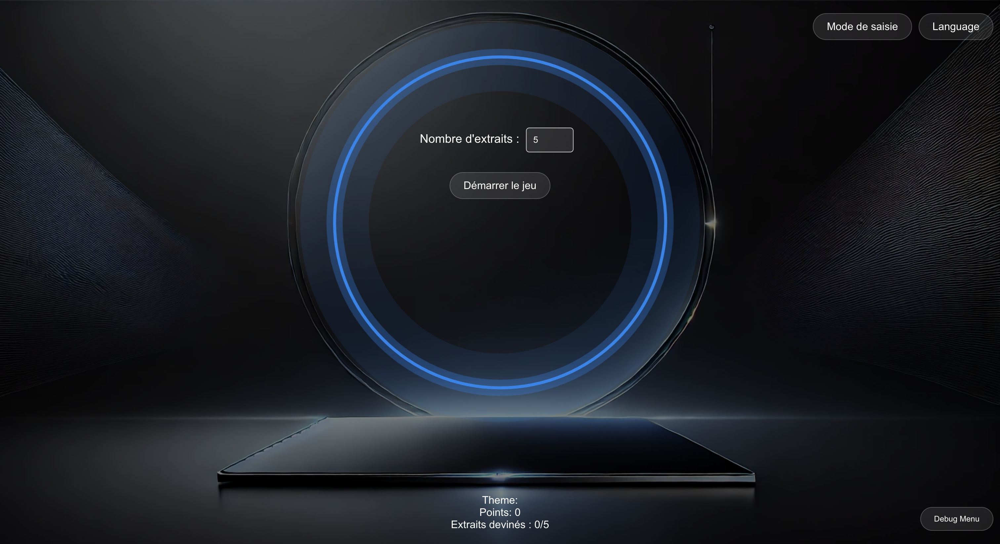
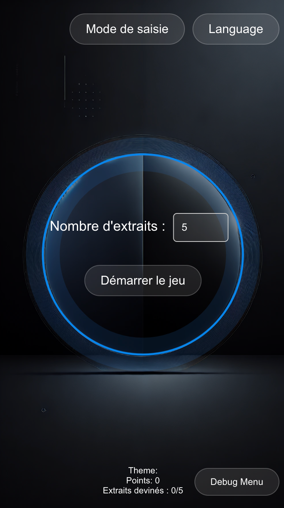

# BlindTest Party - Frontend

This is the **frontend** part of the BlindTest Party web application, where users can interact with a music guessing game. The frontend allows users to choose themes, listen to music clips, and guess the songs either via text input or voice input.

A live version of the app is available at: [BlindTest Party Live](https://blindtest-party.netlify.app/)





## Table of Contents
- [Technologies](#technologies)
- [Features](#features)
- [Setup and Installation](#setup-and-installation)
- [Environment Variables](#environment-variables)
- [Running the Project Locally](#running-the-project-locally)
- [Deployment](#deployment)
  
## Technologies
- **React.js** for UI
- **Lottie** for animations
- **Web Speech API** for voice recognition and TTS
- **OpenAI TTS API** for enhanced voice synthesis
- **Axios** for API requests
- **Netlify** for frontend hosting
- **CSS** for styling and responsive design

## Features
- Users can switch between text and voice input modes.
- Responsive design optimized for desktop and mobile.
- Multiple languages supported for game interaction.
- Smooth voice-to-text and text-to-voice gameplay experience.
- Lottie animations that react to game states (speaking, idle, waiting).
- Integration with backend for song clips and game management.

## Setup and Installation

### Prerequisites
- **Node.js** and **npm** installed locally.
- An account with **OpenAI** (for TTS).
- A deployed backend service.

### Steps to Install Locally
1. Clone this repository:
   ```bash
   git clone https://github.com/your-repo/blindtest-frontend.git
   cd blindtest-frontend
   ```
2. Install the dependencies:
    ```bash
    npm install
    ```
3. Set up your environment variables in a `.env` file (see below).

## Environment Variables
Create a `.env` file at the root of the project with the following variables:
```bash
REACT_APP_BACKEND_URL=https://your-backend-url.com
REACT_APP_OPENAI_API_KEY=your-openai-api-key
REACT_APP_SPOTIFY_CLIENT_ID=your-spotify-client-id
REACT_APP_SPOTIFY_CLIENT_SECRET=your-spotify-client-secret
```

## Running the Project Locally
To run the development server:
```bash
npm start
```
This will start the React app on `http://localhost:3000`.

## Deployment
For deployment, the project uses **Netlify**.

